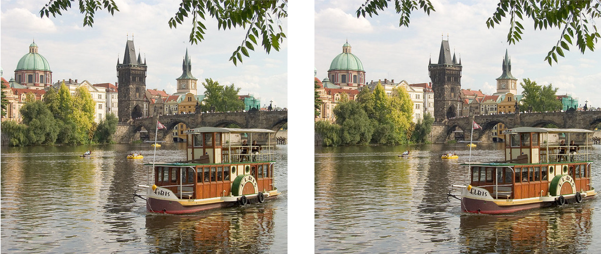

# Content-Aware Image Resizing

This is an implementation of the content-aware image resizing technique described in the paper -
[Seam Carving for Content-Aware Image Resizing](http://www.cs.utexas.edu/~grauman/courses/spring2011/slides/a10-avidan.pdf) - by Shai Avidan and Ariel Shamir that allows a more visually pleasing reduction in the size of the image.


## How to Run
**SeamCarvingReduceWidth.py** and **SeamCarvingReduceHeight.py** reduce the width and height, respectively, of an image by some arbitrary number of pixels. They require 2 arguments: the path to input image and the number of pixels to reduce it by. The reduced image is stored as _outputReduceWidth.png_ or _outputReduceHeight.png_  respectively.

```
$ python3 SeamCarvingReduceWidth.py ./path/to/image.jpg numPixels
```

or

```
$ python3 SeamCarvingReduceHeight.py ./path/to/image.jpg numPixels
```

## Example

<!-- ### Example 1 -->


The first seam found is that of lowest energy and a lowest energy seam would consist of pixels that are relatively the same with little or no difference to their neighboring pixels. As seen in figure (e), for the horizontal seam in orange, it mainly passes through the sky having colors blue and white, barely touching the leaves in the upper part of the picture, the top of the buildings, and some prominent clouds. Similarly, the vertical seam passes through water where there is a long shadow of constant color. In the other parts of the water, there are a lot of disturbances from objects, their shadows, and water ripples. Moreover, it is seen that the seam also passes through the tower at the end of the bridge instead of the building on the left as the building on the left is more detailed and a seam through the building would have higher changes and hence higher energies.


To reduce width for example 1:

```
$ python3 SeamCarvingReduceWidth.py ./examples/inputSeamCarvingPrague.jpg 100
```

or alternatively to reduce height,

```
$ python3 SeamCarvingReduceHeight.py ./examples/inputSeamCarvingPrague.jpg 100
```

Different energy functions can lead to better results, as seen below. The image on the left is the one obtained when Sobel operator is used to compute the energy image and the image’s width is reduced by 100. The bridge tower here is better preserved compared to the image on the right that represents the resized image using the original energy function, which exploits gradient changes.


